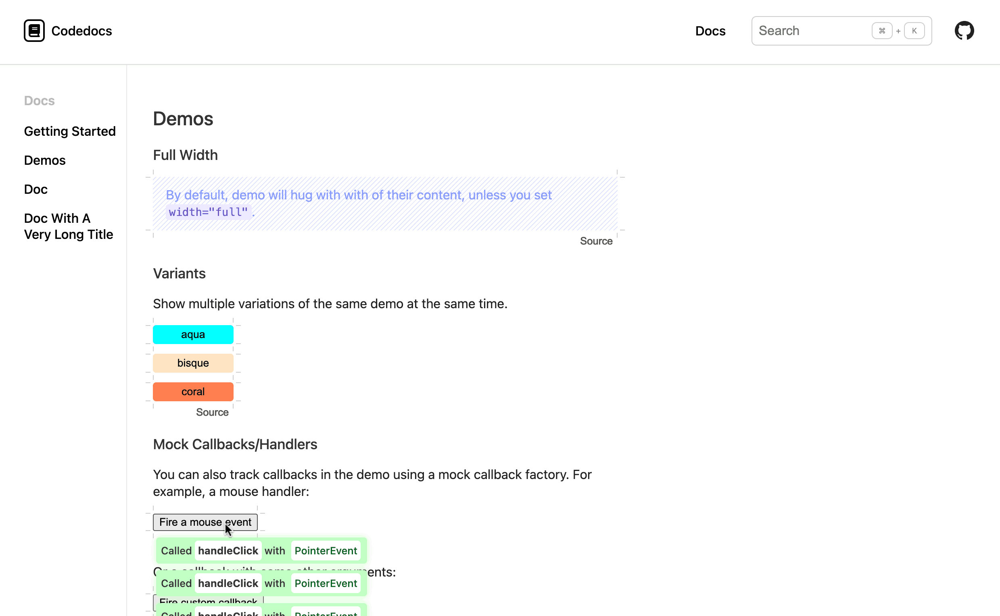
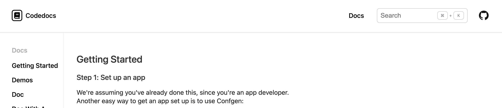
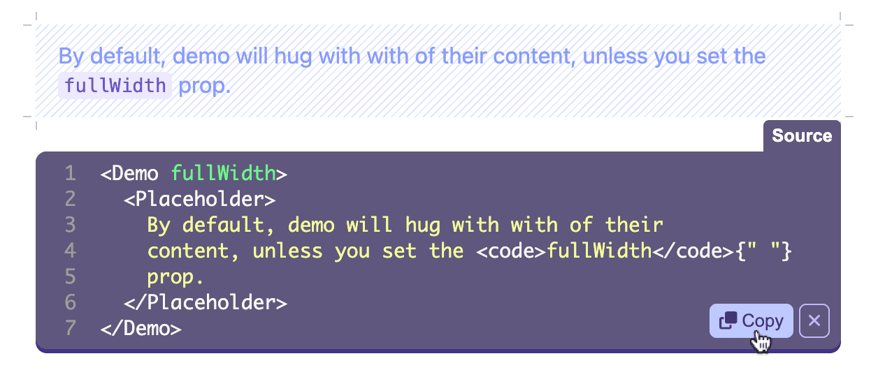
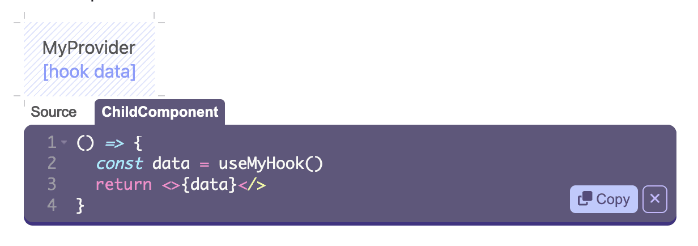
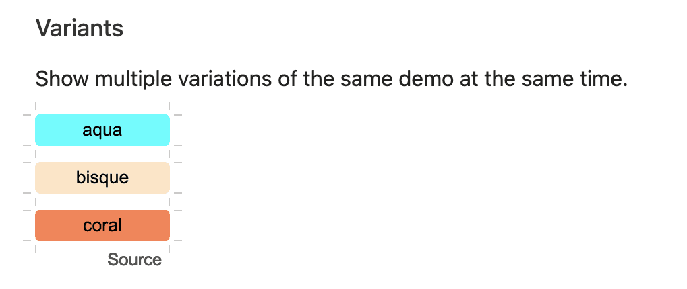
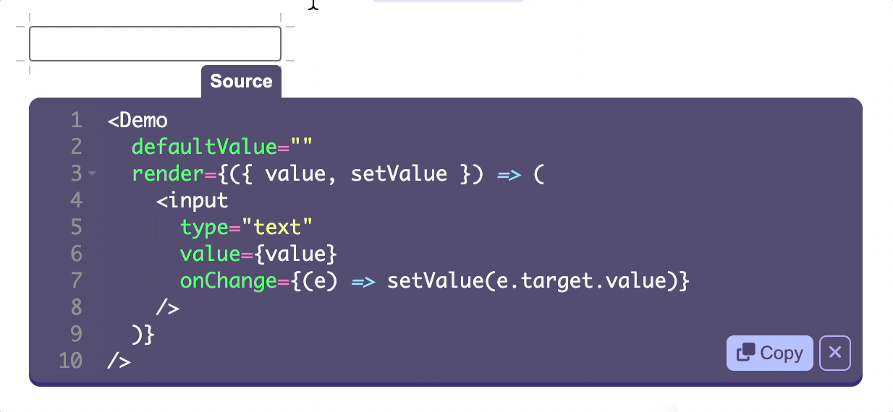

[](https://codedocs.ambic.app/)

**Codedocs** is a Storybook replacement that's designed for the professional application developer. It presumes you've already set up a React application build pipeline, that you're happy with it, and you just want to document your components.

## Table of contents

- [Features](#features)
- [How it works](#how-it-works)
- [What it doesn't do](#what-it-doesnt-do)
- [Context Providers](#context-providers)
- [Example](#example)
- [Future](#future)
- [Inspiration](#inspiration)

## Features

### Public-facing documentation

Use unrestricted HTML to build your documentation. Codedocs looks great as a public-facing documentation site:



### Real code samples

Taken directly from the demos in your source files. These can be JSX, or full renderers including hooks and other boilerplate.



You can even do demos that require multiple interacting parts, for example to demonstrate a context provider and a hook:




### Variants

```tsx
<Demo
  inline
  variants={["aqua", "bisque", "coral"]}
  render={({ variant }) => /* ... */}
/>
```



### And more...

Simple state helper for demos that just need basic set/get functionality:



## How it works

Your documentation files can still live alongside your code, but they just export JSX elements:

```tsx
// Button.docs.tsx
import React from "react"
import { Doc, Demo } from "codedocs"
import { Button } from "./Button"

export const ButtonDocs = (
  <Doc path="/Controls/Button">
    <p>
      The Button is meant to be used for everything that can be tapped, whether
      or not it has a background.
    </p>
    <h2>Basic Button</h2>
    <Demo>
      <Button>Save</Button>
    </Demo>
  </Doc>
)
```

Then, you can go ahead and use Vite, or Bun, or whatever you already are using
to build your app and throw an index.html somewhere. That's up to you. To get
the site working, all you need to do is render `<DocsApp>` in there:

```tsx
import { ButtonDocs } from "./Button.docs"
import { DocsApp } from "codedocs"
import React from "react"
import { render } from "react-dom"

render(<DocsApp docs={[ButtonDocs]} />, document.getElementById("root"))
```

You can set up the build however you want. That's the point, you can just use
the same build infrastructure you've surely already set up to build your Design
System.

## Context Providers

If you're maintaining a design system, or just a component library, you likely have:

- global styles
- a theme object
- other React contexts

That are required by your components. You can provide a provider that sets those up:

```js
import { Global, ThemeProvider } from '@emotion/react'
import React from 'react'
import reset from 'emotion-reset';

<DocsApp
  docs={...}
  DesignSystemProvider={({ children }) => (
    <ThemeProvider theme={...}>
      <Global styles={reset} />
      <Global styles={`
        body {
          font-family: 'sans-serif'
        }
        ...
      `} />
      {children}
    </ThemeProvider>
  )}
  ...
/>
```

## What it doesn't do

- **Doesn't** work with anything other than React and React Router. If you are using Svelte or Ember you're out of luck.
- **Doesn't** provide interactive "knobs". Demos are just code samples. If you want to change the demo, you change the code.
- **Doesn't** magically scan through your source tree and "analyze" it. Magic is great when it works, until it doesn't. Your Codedocs are _just a normal React component_. You build it right alongside your components, within the same build system.
- **Doesn't** set up the devevelopment or deploy scripts for you. You are a professional application developer. You've probably already set up lots of infrastructure for deploying apps using your Design System. You can keep doing that. The `codedocs` package provides some React components that make it easy to turn documentation files into site.

The other thing is doesn't do is _have any dependencies_. You provide React and React Router as peerDependencies, and that's it.

## Example

For an example, check out Codedocs own docs in [/docs](/docs). You can see these running by cloning this repo and running `npm run start:docs:dev`.

## Future

The general philosophy of Codedocs is

1. It's OK to manually maintain docs, not everything has to be magic
2. This is really about explanation not "documentation"
3. Work within the existing build
4. Give the best possible realtime feedback

Roadmap to 1.0

- [x] Render demos
- [x] Site sections, pages, homepage, nav
- [x] Prose documentation (HTML)
- [x] Publish static sites
- [x] Search
- [x] Demos with state, hooks, etc
- [x] Extract source vía macro
- [x] Show events emitted from demos
- [x] Variant demos
- [ ] ApiReference
- [ ] Dark mode
- [ ] Contact sheet
- [ ] Live edit demos (at least on localhost)
- [ ] Live edit headings, paragraphs, etc
- [ ] Visual tests
- [ ] Fullscreen demos

## Inspiration

- https://wattenberger.com/blog/react-and-d3
- https://stitches.dev/docs/variants
- https://eslint.org/docs/latest/user-guide/configuring/configuration-files
- https://www.apollographql.com/docs/react/
- https://evergreen.segment.com/components/table
- https://docs.drone.io/runner/kubernetes/configuration/resources/
